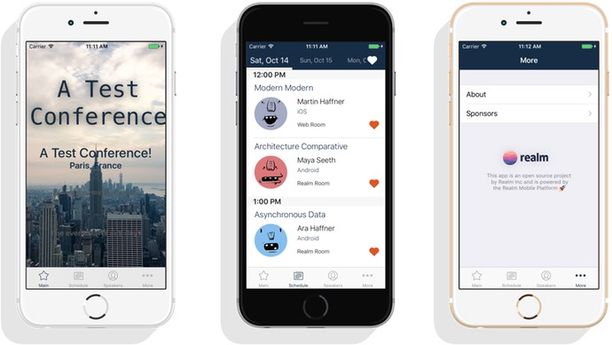

# EventBlank for iOS

This is the iOS app of the EventBlank project. For an overview of the whole project head to the [main readme](../README.md).



## Installation

**Requirements:** Xcode 8.3.2, Swift 3.1, CocoaPods, Terminal

### Set up the server

Before running a client app you need to setup the server. [More info here](../server/README.md).

### Setting up the iOS project

In the **iOS** folder of this project copy the file `example-set-keys.sh` to `keys-local.sh` and edit the new file setting the placeholder values with your own. Here's an example:


For a locally running server keep the scheme, host and port values the same. Change username and password to the credentials of the user with read-only access (as created during the server setup).

Finally edit the `path` value by replacing the unique id in the example with the ID of the read-write user you created. You can find the ID in the server console:


Once you finish editing `keys-local.sh` open the a terminal and make the file executable (line 1) and run it (line 2):

```
chmod +x keys-local.sh
./keys-local.sh
```

This will configure the connection data to your server and install all iOS project dependencies.

### Running EventBlank for iOS

At that point you can open **EventBlank2-iOS.xcworkspace** in Xcode, build and run the app. If you followed the instructions correctly and created test data on the server you will see that data show up in your app.

## Credits

### License

[MIT licensed.](LICENSE)

### About


The names and logos for Realm are trademarks of Realm Inc.

We :heart: open source software!

See [our other open source projects](https://realm.github.io), check out [the Realm Academy](https://academy.realm.io), or say hi on twitter ([@realm](https://twitter.com/realm)).
