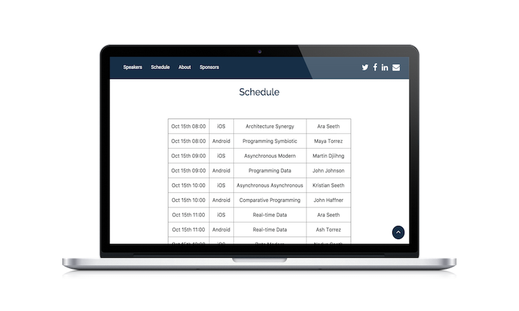

# EventBlank for Web with Node.js

This part of the project builds a real-time website using the EventBlank data. For an overview of the whole project head to the [main readme](../README.md).


## Installation

**Requirements:** Node.js

### Running the website Node app

To run the app that generates the EventBlank website enter the following command (or edit the `website.sh` script in the **web** folder and run it).

```
node website-app.js \
  --host localhost \
  --port 9080 \
  --username eventblank-admin@host \
  --password password123 \
  --tokenpath ../../realm/access.base64 \
  --admintokenpath ../../admin_token.base64 \
  --templatepath ../template/Bell \
  --outputpath ../www 
```

This command will run the `website-app.js` app. Let's look at the parameters :

* `host` - your server host
* `port` - the port ROS is running on
* `username` - the eventblank read-write user name
* `password` - the eventblank read-write user password
* `tokenpath` - the path to a file containing your feature token
* `admintokenpath` - the path to a file containing your admin token
* `templatepath` - the path to the website template folder
* `outputpath` - where to save the generated website

While the app is running it will monitor the Eventblank file on the server and upon any changes will re-generate the Eventblank website in the given output directory.

In case the Node app is running on a server, which serves the web site, your users will see always the up to date content.

In case you're generating the website locally, you can re-upload the web page at your convenience.

If you aren't interested in real-time changes you can stop the app as soon as it finishes running - it re-generates the web site when it's being started.



## Credits

### License

[MIT licensed.](LICENSE)

### About


The names and logos for Realm are trademarks of Realm Inc.

We :heart: open source software!

See [our other open source projects](https://realm.github.io), check out [the Realm Academy](https://academy.realm.io), or say hi on twitter ([@realm](https://twitter.com/realm)).
